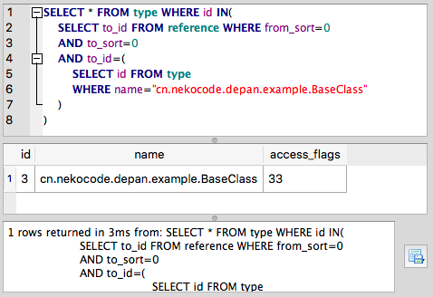

This is a gradle plugin to extract the dependencies between classes, fields and methods in your Android project. And save to a sqlite database file. 

It's inspried by the Google's [depan](https://github.com/google/depan) project.

## Database structure

There is a `type` table to save all type (class and interface) names:

| Column | Description |
| :- | :- |
| id | ID of this type |
| name | Name of this type |

A `field` table to save all fields of all classes:

| Column | Description |
| :- | :- |
| id | ID of this field |
| name | Name of this field |
| type | ID of this field's type |
| owner | ID of this field's owner type |
| string_id | Internal use only |

A `method` table to save all methods of all classes:

| Column | Description |
| :- | :- |
| id | ID of this method |
| name | Name of this method |
| desc | Description of this method, such as `(Ljava/lang/String)V` |
| owner | ID of this method's owner type |
| string_id | Internal use only |

And lastly there is a `reference` table to save references between all types, fields and methods:

| Column | Description |
| :- | :- |
| id | ID of this method |
| from_sort | Sort of this reference's source, can be `T`(Type), `F`(Field) or `M`(Method) |
| from_id | ID of this reference's source |
| to_sort | Sort of this reference's target, can be `T`(Type), `F`(Field) or `M`(Method) |
| to_id | ID of this reference's target |
| relation | Relation of this reference. *See next paragraph for details.* |
| string_id | Internal use only |

Take `A references B` for example, the relation of this reference can be:

| Relation | Description |
| :- | :- |
| E | Type to Type, means `A extends B` or `A implements B` |
| T | Field/Method to Type, means `The type of A is B` or `A uses type B` |
| C | Method to Field/Method, means `Method A access filed B` or `Method A calls method B` |
| A | Type/Field/Method to Type, means `A is annotated with B` |

## Usage

The `${lastest-version}` of this plugin is [](https://jitpack.io/#nekocode/DepAnPlugin). Copy below code to the `build.gradle` of your android application project.

```gradle
buildscript {
    repositories {
        maven { url "https://jitpack.io" }
    }
    dependencies {
        classpath "com.github.nekocode:DepAnPlugin:${lastest-verion}"
    }
}

apply plugin: 'depan'
 
depan {
    outputDirFile = new File(project.buildDir, "depan")
//  enabled = true
    typeFilter { typeName ->
        typeName.startsWith("cn.nekocode.depan.example") &&
                !typeName.endsWith(".R") &&
                !typeName.contains(".R\$") &&
                !typeName.contains(".databinding.") &&
                !typeName.endsWith(".BR")
    }
}
```

Then, you will get a sqlite database file named `${buildType}.db` in the specified outputDir when you run the corresponding `assemble${buildType}` Task.

Now, you can query this database file by any sqlite client: 


